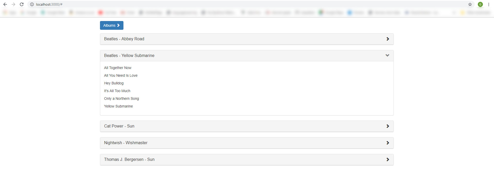

Note:

I regret that I spent more time than the suggested 3 hours on this, I did nt quite put a timer but it must have been more
like 6 or even 7 hours by now. ( I started around 07:20 - with several shorter or longer breaks in between - and it is nearly 17:00 now ).

Some time was spent setting up the project, learning how to use Thunk ( in my company we use redux-saga but for this I wanted to give Thunk a try as it is more lightweight ), a typo ( I imported bindActionCreators from react instead from redux ) caused me extra delays until i realize why things were not working, plus some further css related delays ( used latest react-bootstrap & bootstrap and I realized that I cannot really add the chevron arrow left/down because latest bootstrap has dropped Glyphicons & the only solution I knew, as react-bootstrap does not offer those chevrons out of the box, was Glyphicons & css related, so I had to downgrade to bootstrap 3.X and also refactor the collapsible panels as the earlier react-bootstrap version is quite different there than the latest version I initially used ).
I also spent some time thinking how to best parse the data and how to group albums within bands and songs within albums and how to make things a bit more concise.

Thank you very much for the opportunity you offered me and for this interesting task.

To install, after you clone this repo please do :

### `npm install`

followed by a 

### `npm start`

then in a browser visit :

### `http://localhost:3000`
